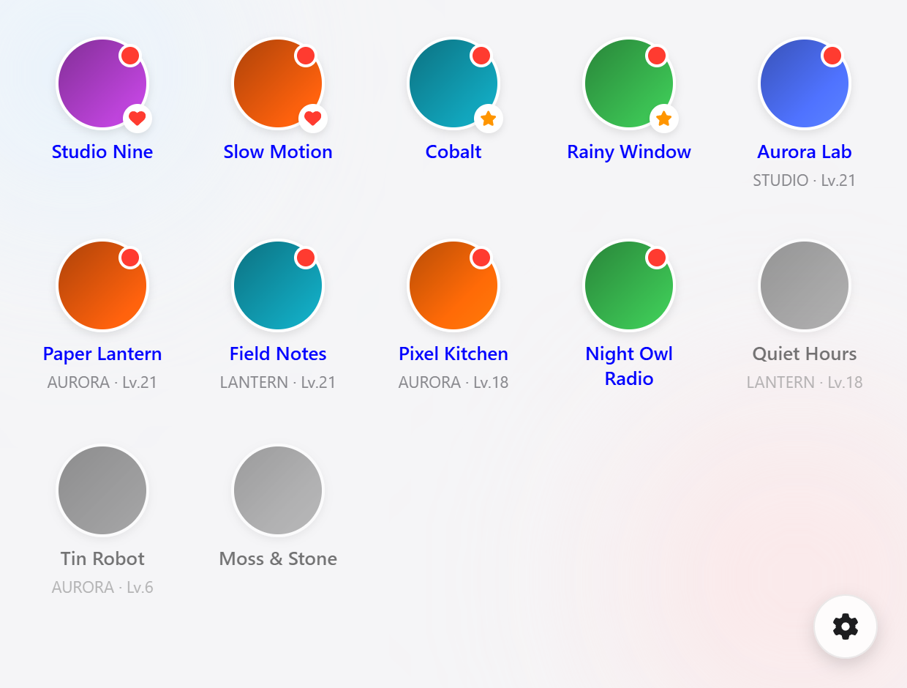
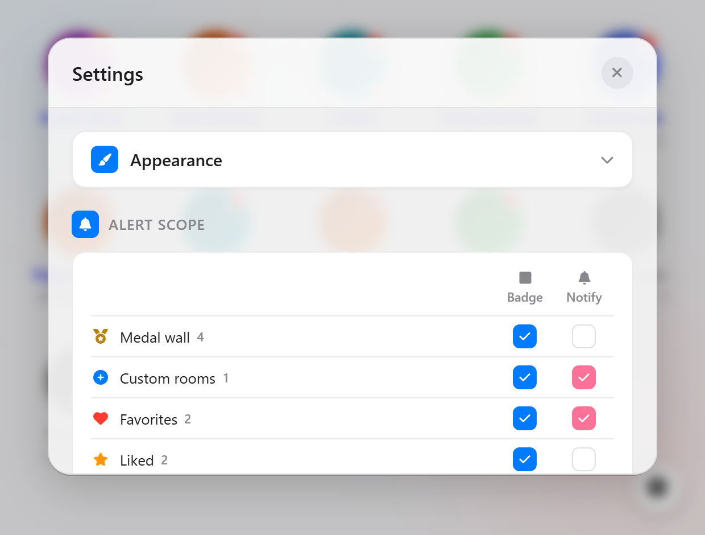

# BiliStreamMonitor

Know when the Bilibili streamers you care about go live, without opening the site.

<p>
  <a href="https://github.com/1morr/biliStreamMonitor/actions/workflows/ci.yml"></a>
  <a href="LICENSE"></a>
  
</p>

**English** · [繁體中文](README.zh-Hant.md)

A Chrome extension that watches your followed streamers and puts a count on the
toolbar icon when someone you care about starts broadcasting. Hover an avatar to
preview the stream; click to open it.



## Install

Not on the Chrome Web Store yet, so load it unpacked:

1. Download or clone this repository.
2. Open `chrome://extensions/` and turn on **Developer mode**.
3. Click **Load unpacked** and select the folder containing `manifest.json`.

There is no build step — the source is the extension. You need **Chrome 120 or
later** (earlier versions silently clamp the refresh interval to 60 s) and you
must be **logged in to Bilibili** in the same profile; the extension reads your
`DedeUserID` cookie to find your follow list.

## Alert scope

The point of the extension is that "who I follow" and "who I want to be
interrupted for" are different sets. You pick the second one.

Five sources feed two independent channels — the **badge** on the toolbar icon
and **desktop notifications**. Tick each cell you want:

| Source | Who it is | Cost per cycle |
|---|---|---|
| Medal wall | Streamers you hold a fan medal for | 1 request, always fetched |
| Custom rooms | Rooms you added by number, followed or not | shares 1 batch request |
| Favorite / Like | Streamers you right-click-marked | free — their uids are already known |
| All other follows | Everyone else you follow | about +5 requests (paged) |

Each streamer counts in the **first** row it matches, so the numbers add up
cleanly. The settings panel shows live per-channel totals and the resulting
request count.

The default is 2 requests per cycle, because "all other follows" is off. Turning
it on is the only thing that makes the extension page your whole follow list.



## Features

- **Badge** — how many streamers in scope just went live, coloured by priority
  (favorite red, like orange, otherwise blue), capped at `99+`.
- **Notifications** — click one to jump straight into the room. At most 5 per
  cycle; the rest collapse into a single "N others went live".
- **Silent seeding** — the first cycle after installing, after changing your
  alert scope, or after a rate-limit pause only syncs state. It never fires a
  backlog of alerts, so the badge cannot jump to three digits at once.
- **Hover preview** — the stream title, cover and elapsed time, or a live mini
  player with volume control.
- **Four display modes** — hover the gear to fan them out: alert scope
  (default), medal wall, marked only, or everything currently live.
- **Right-click a streamer** to mark them Favorite or Like, or hide them.
- **Custom rooms** — paste a room number or URL to watch someone you do not
  follow. Their status refreshes in the same batch request as everyone else.
- **Import / export** your configuration, validated key by key on the way in.
- **English / 简体中文 / 繁體中文**, following the browser language.
- **Rate-limit backoff** — when Bilibili pushes back, the extension pauses
  5 → 10 → 20 → 30 minutes and says so on the badge and in the popup, then
  resumes on its own.

## Permissions

| Permission | Why |
|---|---|
| `cookies` | Read `DedeUserID` to identify your account. Nothing else is read, stored, or sent |
| `storage` | Your settings, marks, and the last known stream states |
| `alarms` | Drive the refresh cycle (a service worker cannot hold a timer) |
| `notifications` | The go-live notifications |
| `*.bilibili.com` | The live API and the preview player |
| `*.hdslb.com` | Avatars and stream covers |

No `<all_urls>`, no analytics, no third-party requests. The content script runs
on exactly one URL pattern, to keep the preview player in sync.

## Configuration

Everything lives behind the gear in the popup: refresh interval (30 s minimum,
60 s default), popup size, avatar size, spacing, font size, light/dark theme,
preview mode, hidden list, and the alert-scope matrix.

## Development

No build, no bundler. Edit a file and hit reload on the extension card.

```bash
npm install      # only to get eslint
npm run lint
npm test         # node --test over the pure modules in shared/
```

`shared/scope.js` is the single source of truth for which streamer belongs to
which alert source; the poller, the notifier and the popup all read it, and it
is what the tests cover. More detail in [docs/](docs/) (Traditional Chinese).

## License

[MIT](LICENSE)
